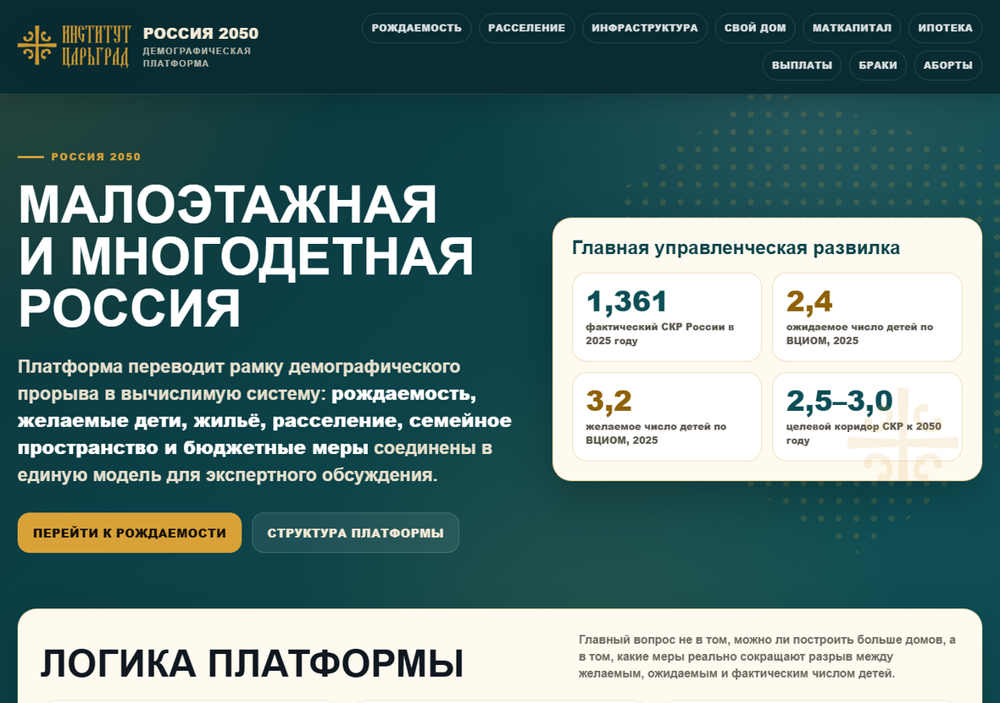
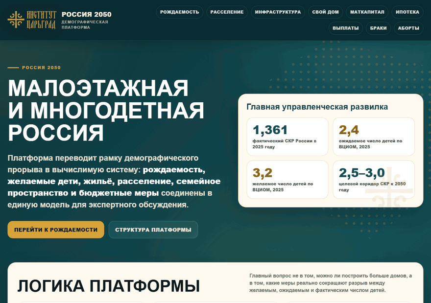
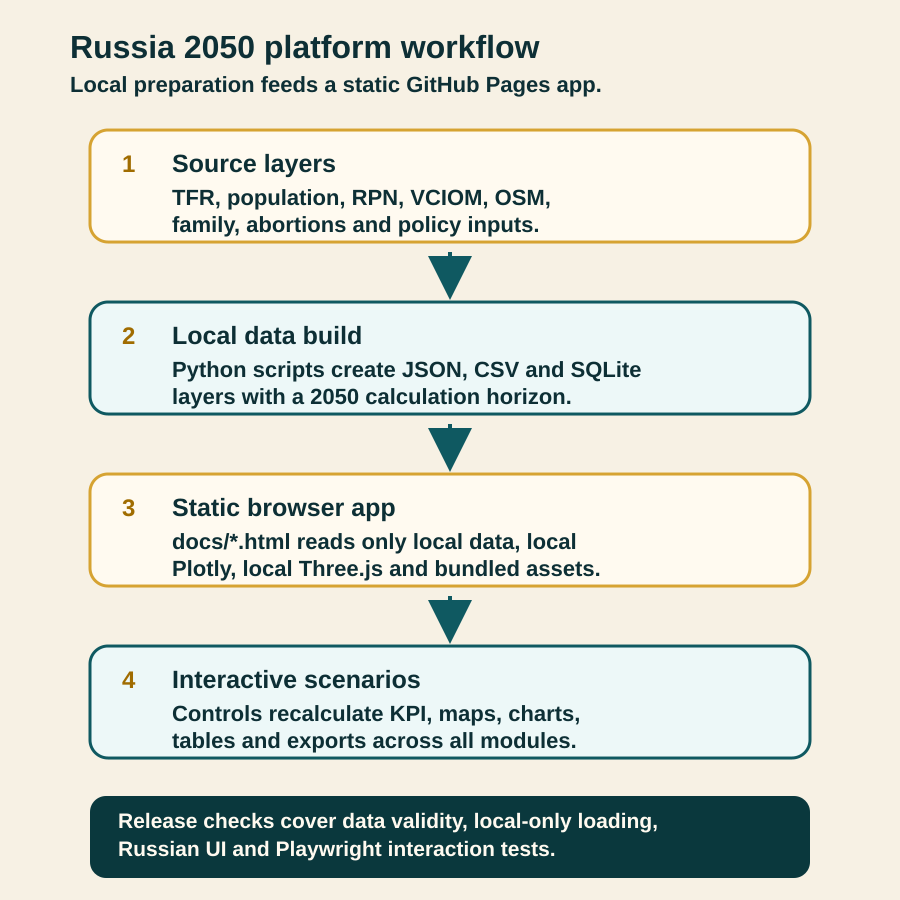
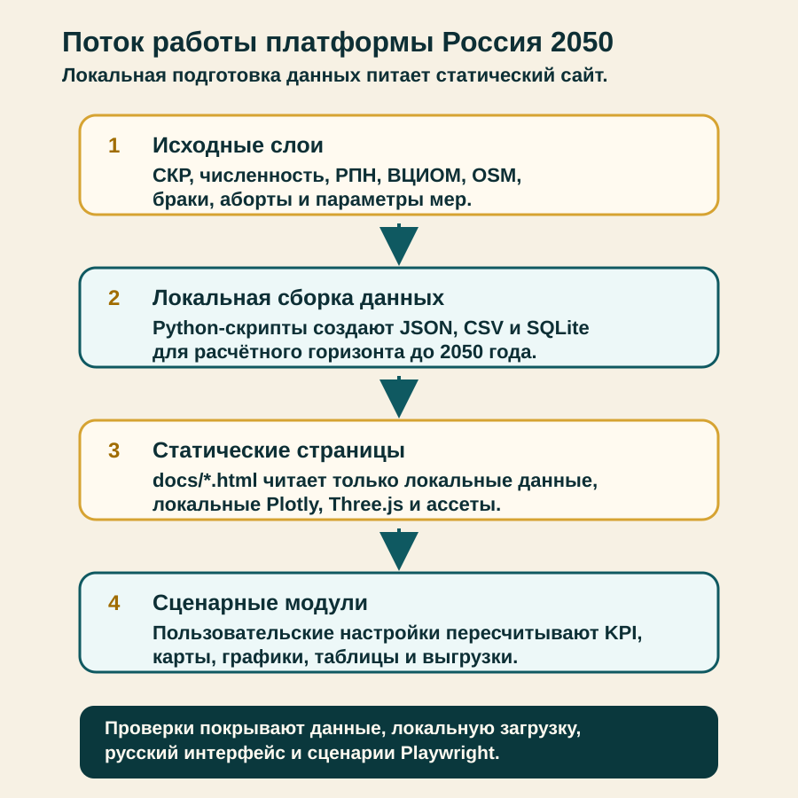

# Russia 2050 demographic platform

[English](#english) | [Русский](#русский)


*Russian-only public dashboard home page.*

<a id="english"></a>
## English

**Live site:** [arseniy24rus.github.io/Tsargrad-demographic-platform](https://arseniy24rus.github.io/Tsargrad-demographic-platform/)

### Capabilities And Scenario

This repository is a self-contained static decision-support platform for discussing the demographic frame called “Russia 2050”. The audience is a policy or expert group that needs to see how fertility, housing, settlement structure, infrastructure readiness and family-support instruments interact. The product is not an official demographic forecast and it is not a causal proof system; the methodology states that every calculation is a scenario layer capped at 2050 ([docs/METHODOLOGY.md](docs/METHODOLOGY.md)).

The user interface is Russian only. A typical session starts on [docs/index.html](docs/index.html), opens [docs/skr.html](docs/skr.html) to compare Russia, a federal district, or a federal subject against the national target corridor, switches from brief to detailed mode, and then moves to [docs/infrastructure.html](docs/infrastructure.html) to see whether selected settlements have the roads, utilities, education, medicine, services and communications needed for low-rise family settlement. Other modules cover settlement scenarios, a Three.js multigenerational home model, maternity-capital scenarios, mortgage subsidy calculations, monthly payments, marriage/divorce indicators and abortion-monitoring indicators.


*Demo: fertility chart, housing-effect scenario controls and infrastructure filtering in the Russian UI.*

### Data And Methodology

The data approach is local-first. Files used by the browser live under [docs/data](docs/data), with a manifest in [docs/DATA_MANIFEST.md](docs/DATA_MANIFEST.md). The fertility module combines monthly TFR facts with local author forecast layers such as `author_tfr_forecast_2050.json` and `skr_monthly_forecast_2050.json`. RPN 2022 is used as a federal sociological layer, while regional RPN comparisons are limited to safely matched 2012/2017 data. The infrastructure module summarizes 85 regions and 155,741 settlements from locally prepared open geodata; heavy OSM extracts and intermediate files are not shipped to the browser. VCIOM 2025, settlement, family and abortion data are also packaged as local JSON/CSV/SQLite layers.


*Local data preparation feeds a static browser application and scenario modules.*

### Architecture

The architecture is deliberately simple: static HTML, CSS and JavaScript in [docs](docs), local Plotly and Three.js under `docs/assets/vendor`, and Python scripts for data preparation and release checks. Published pages should not call CDNs, GitHub Raw, remote APIs, remote fonts or remote images. The project records that constraint in [AGENTS.md](AGENTS.md), [docs/PROJECT_CONTEXT.md](docs/PROJECT_CONTEXT.md), [docs/ACCEPTANCE_CRITERIA.md](docs/ACCEPTANCE_CRITERIA.md) and the runtime-locality checks. The workflow file [.github/workflows/static-checks.yml](.github/workflows/static-checks.yml) runs the Python audit suite and optional Playwright smoke tests.

### Limitations

Limitations matter. Regional infrastructure scores depend on the completeness of open geodata. Settlement and budget modules are scenario estimates, not official population or fiscal forecasts. The target corridor is a federal frame, not an imposed norm for every subject. The family and abortion pages show aggregate management indicators, not individual predictions or medical advice.

### Local Use

Run locally:

```bash
python -m http.server 8000 --directory docs
```

Open `http://127.0.0.1:8000/index.html`.

<details>
<summary>Useful checks and release command</summary>

Useful checks:

```bash
python scripts/check_json.py
python scripts/check_no_external_runtime.py
python scripts/check_russian_ui.py
python scripts/check_data_locality.py
python scripts/check_nav_numbering.py
python scripts/check_settlement_forecast.py
python scripts/check_matcapital_module.py
python scripts/check_infrastructure_module.py
python scripts/check_family_module.py
python scripts/check_abortions_module.py
"C:\Program Files\Git\bin\bash.exe" scripts/check_js_syntax.sh
npm run test:smoke
npm run test:responsive
```

Published pages are [docs/index.html](docs/index.html), [docs/skr.html](docs/skr.html), [docs/settlement.html](docs/settlement.html), [docs/infrastructure.html](docs/infrastructure.html), [docs/estate.html](docs/estate.html), [docs/capital.html](docs/capital.html), [docs/mortgage.html](docs/mortgage.html), [docs/payments.html](docs/payments.html), [docs/family.html](docs/family.html) and [docs/abortions.html](docs/abortions.html). A release archive can be built with `python scripts/make_release_zip.py`.

</details>

No top-level project license file is present in this repository. Third-party runtime notices are documented in [docs/THIRD_PARTY_NOTICES.md](docs/THIRD_PARTY_NOTICES.md): Plotly.js and Three.js are MIT licensed, Playwright is development-only, and OpenStreetMap-derived infrastructure layers require ODbL attribution to OpenStreetMap contributors.

<a id="русский"></a>
## Русский

**Живая версия:** [arseniy24rus.github.io/Tsargrad-demographic-platform](https://arseniy24rus.github.io/Tsargrad-demographic-platform/)

### Возможности и сценарий

Репозиторий содержит самодостаточную статическую платформу для экспертного обсуждения рамки «Россия 2050». Её адресат - управленческая или исследовательская группа, которой нужно видеть не один график рождаемости, а связку факторов: фактический и прогнозный СКР, желаемое число детей, жилищные барьеры, расселение, инфраструктуру, семейное пространство и стоимость мер поддержки. Это сценарный инструмент, а не официальный демографический прогноз и не доказательство причинного эффекта; это прямо зафиксировано в [docs/METHODOLOGY.md](docs/METHODOLOGY.md).

Интерфейс платформы только на русском языке. Реальный пользовательский сценарий начинается на [docs/index.html](docs/index.html): руководитель видит рамку платформы, переходит в [docs/skr.html](docs/skr.html), сравнивает Россию, федеральный округ или субъект с федеральным целевым коридором, переключает краткий и подробный режимы, затем открывает [docs/infrastructure.html](docs/infrastructure.html), чтобы проверить готовность территорий к малоэтажному семейному расселению. Остальные страницы закрывают расселение и ИЖС, 3D-модель собственного дома, маткапитал, ипотеку, выплаты, браки и аборты.


*Демо: график рождаемости, настройки жилищного сценария и фильтрация инфраструктурной карты.*

### Данные и методика

Методика построена вокруг локальных данных. Слои, которые читает браузер, лежат в [docs/data](docs/data), а их назначение описано в [docs/DATA_MANIFEST.md](docs/DATA_MANIFEST.md). Модуль рождаемости берёт месячный факт СКР и локальные авторские прогнозы `author_tfr_forecast_2050.json` и `skr_monthly_forecast_2050.json`. РПН-2022 используется как федеральный социологический слой; региональные сопоставления РПН ограничены 2012/2017 годами, где есть безопасное соответствие территорий. Инфраструктурный модуль агрегирует 85 регионов и 155 741 поселение из локально подготовленных открытых геоданных; тяжёлые OSM-выгрузки и промежуточные файлы не загружаются при открытии страниц. ВЦИОМ-2025, расселение, браки и аборты также поставляются локальными JSON/CSV/SQLite слоями.


*Схема: локальная подготовка данных питает статические страницы и сценарные модули.*

### Архитектура

Техническая архитектура намеренно простая: статические HTML/CSS/JavaScript в [docs](docs), локальные Plotly и Three.js в `docs/assets/vendor`, Python-скрипты для подготовки данных и проверок. При открытии страниц не должно быть CDN, GitHub Raw, удалённых API, внешних шрифтов и внешних изображений. Это требование описано в [AGENTS.md](AGENTS.md), [docs/PROJECT_CONTEXT.md](docs/PROJECT_CONTEXT.md), [docs/ACCEPTANCE_CRITERIA.md](docs/ACCEPTANCE_CRITERIA.md) и проверяется локальными аудитами. Рабочий процесс [.github/workflows/static-checks.yml](.github/workflows/static-checks.yml) запускает Python-аудит и опциональные быстрые тесты Playwright.

### Ограничения

Ограничения важны для корректного чтения результатов. Индекс инфраструктурной готовности зависит от полноты открытых геоданных. Расселение, маткапитал, ипотека и выплаты являются сценарными оценками, а не официальным прогнозом населения или бюджета. Целевой коридор СКР трактуется как федеральная рамка России, а не индивидуальная норма для каждого субъекта. Страницы браков и абортов показывают агрегированные управленческие индикаторы, а не индивидуальный прогноз или медицинскую рекомендацию.

### Локальный запуск

Локальный запуск:

```bash
python -m http.server 8000 --directory docs
```

Откройте `http://127.0.0.1:8000/index.html`.

<details>
<summary>Команды проверки и выпуска</summary>

Основные проверки:

```bash
python scripts/check_json.py
python scripts/check_no_external_runtime.py
python scripts/check_russian_ui.py
python scripts/check_data_locality.py
python scripts/check_nav_numbering.py
python scripts/check_settlement_forecast.py
python scripts/check_matcapital_module.py
python scripts/check_infrastructure_module.py
python scripts/check_family_module.py
python scripts/check_abortions_module.py
"C:\Program Files\Git\bin\bash.exe" scripts/check_js_syntax.sh
npm run test:smoke
npm run test:responsive
```

Публикуемые страницы: [docs/index.html](docs/index.html), [docs/skr.html](docs/skr.html), [docs/settlement.html](docs/settlement.html), [docs/infrastructure.html](docs/infrastructure.html), [docs/estate.html](docs/estate.html), [docs/capital.html](docs/capital.html), [docs/mortgage.html](docs/mortgage.html), [docs/payments.html](docs/payments.html), [docs/family.html](docs/family.html) и [docs/abortions.html](docs/abortions.html). Релизный архив собирается командой `python scripts/make_release_zip.py`.

</details>

В репозитории нет отдельного корневого файла лицензии проекта. Атрибуция сторонних компонентов описана в [docs/THIRD_PARTY_NOTICES.md](docs/THIRD_PARTY_NOTICES.md): Plotly.js и Three.js распространяются под MIT, Playwright используется только для разработки, а производные инфраструктурные данные OpenStreetMap требуют сохранения атрибуции OpenStreetMap contributors по ODbL.
